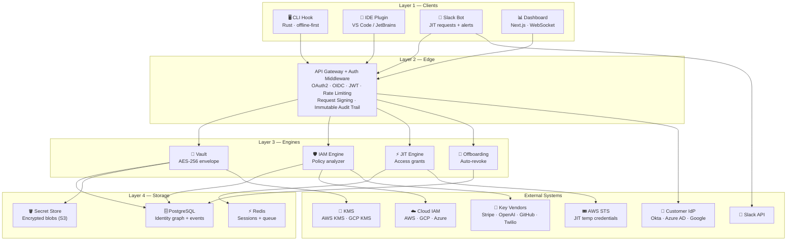
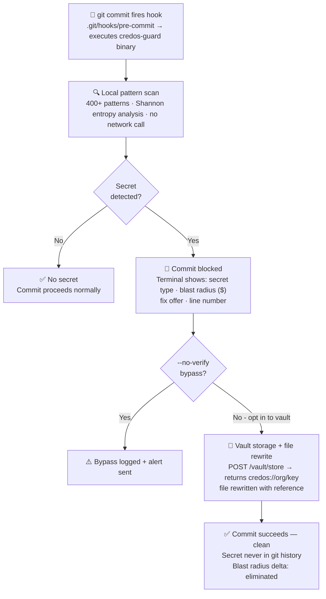
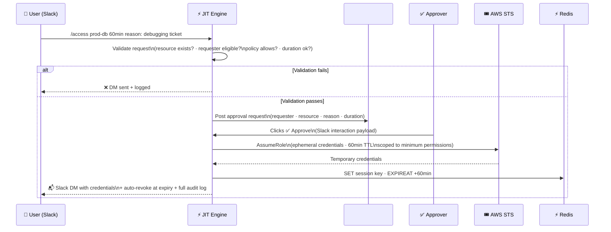
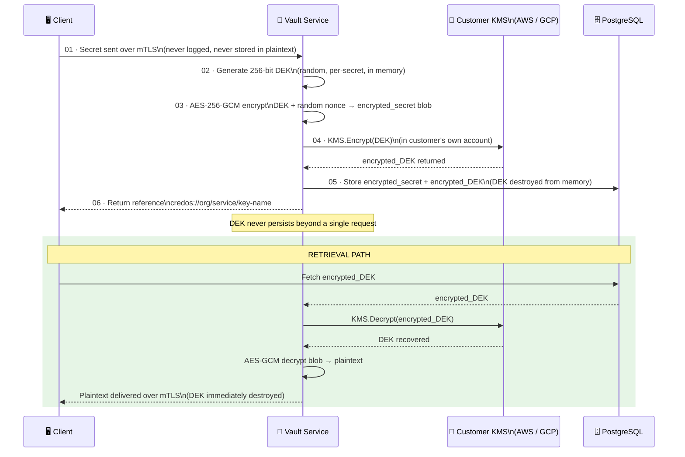
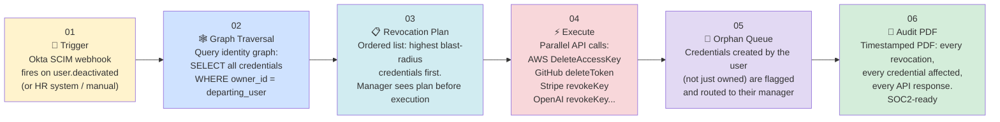
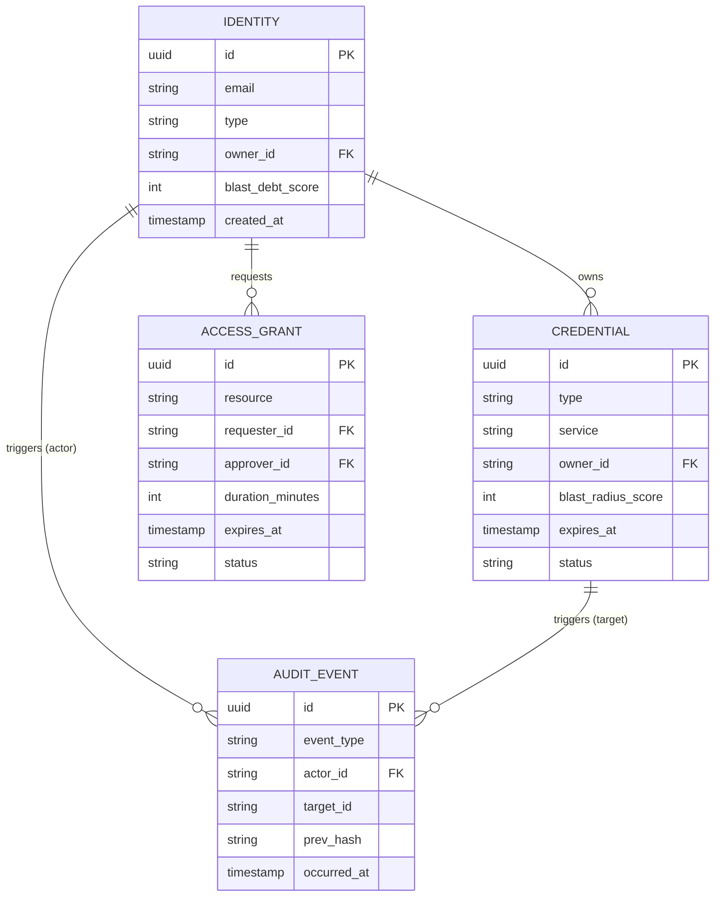

# CredOS — Full Technical Architecture

> **4-layer system:** Developer Clients → API Gateway → Domain Engines → Data Stores.
> External systems (AWS, KMS, Slack, Provider APIs) connect at the engine layer.

---

## Table of Contents

1. [System Overview](#system-overview)
2. [Data Flow 1 — Pre-Commit Secret Detection](#data-flow-1--pre-commit-secret-detection)
3. [Data Flow 2 — JIT Access via Slack](#data-flow-2--jit-access-via-slack)
4. [Data Flow 3 — Vault Envelope Encryption](#data-flow-3--vault-envelope-encryption)
5. [Data Flow 4 — Employee Offboarding](#data-flow-4--employee-offboarding)
6. [Identity Graph — Core Schema](#identity-graph--core-schema)
7. [Technology Decisions](#technology-decisions)
8. [Security of CredOS Itself](#security-of-credos-itself)

---

## System Overview

```
┌─────────────────────────────── LAYER 1: CLIENTS ────────────────────────────────┐
│                                                                                   │
│   CLI Hook          IDE Plugin         Slack Bot          Dashboard              │
│   Rust·offline      VS Code /          JIT requests       Next.js·              │
│   first             JetBrains          + alerts           WebSocket             │
│                                                                                   │
└───────────────────────────────────────┬───────────────────────────────────────────┘
                                         │
┌───────────────────────────── LAYER 2: EDGE ────────────────────────────────────┐
│                                        │                                         │
│              API Gateway + Auth Middleware                                       │
│     OAuth2 · OIDC · JWT · Rate Limiting · Request Signing                       │
│                     Immutable Audit Trail                                        │
│                                                                                  │
└───────────────────────────────────────┬──────────────────────────────────────────┘
                                         │
┌──────────────────────────── LAYER 3: ENGINES ──────────────────────────────────┐
│                                                                                   │
│   ┌──────────────┐   ┌──────────────┐   ┌──────────────┐   ┌──────────────┐   │
│   │    Vault      │   │  IAM Engine  │   │  JIT Engine  │   │ Offboarding  │   │
│   │ AES-256       │   │   Policy     │   │    Access    │   │ Auto-revoke  │   │
│   │ envelope      │   │   analyzer   │   │    grants    │   │              │   │
│   └──────┬───────┘   └──────┬───────┘   └──────┬───────┘   └──────┬───────┘   │
│          │                   │                   │                   │           │
│   External Calls:   Cloud IAM (AWS/GCP/Azure) · KMS · Key Vendors · Slack API  │
│                     Customer IdP (Okta, Azure AD) · AWS STS                     │
└───────────────────────────────────────┬──────────────────────────────────────────┘
                                         │
┌──────────────────────────── LAYER 4: STORAGE ──────────────────────────────────┐
│                                                                                   │
│   PostgreSQL                  Redis                    Secret Store              │
│   Identity graph              Sessions + queue         Encrypted blobs (S3)      │
│   + events                                                                        │
│                                                                                   │
└───────────────────────────────────────────────────────────────────────────────────┘
```



---

## Data Flow 1 — Pre-Commit Secret Detection

> **Privacy guarantee:** The CLI runs fully offline. No staged file content leaves the developer's machine. The API call for blast radius scoring sends only metadata (secret type + hash prefix) — never the raw secret value. The vault storage offer is always opt-in.



---

## Data Flow 2 — JIT Access via Slack

> **Speed guarantee:** The entire loop — from Slack command to temporary credential delivery — completes in **under 60 seconds**. All session tokens are tracked in Redis with a TTL. Revocation is automatic: no human action required, no forgotten access.



---

## Data Flow 3 — Vault Envelope Encryption

> **Zero-knowledge guarantee:** The plaintext secret never exists in CredOS infrastructure — it is encrypted client-side before transit. CredOS cannot read your secrets because the Key Encryption Key (KEK) lives in your own KMS account, not CredOS servers.



---

## Data Flow 4 — Employee Offboarding



---

## Identity Graph — Core Schema

> Four entities model the entire credential universe. The graph is queried for blast radius traversal, offboarding, and compliance evidence.



---

## Technology Decisions

| Layer | Technology | Rationale |
|---|---|---|
| **CLI / Pre-commit** | **Rust** | Single static binary, 3ms startup, cross-platform. No runtime dependency. Installed via npm, pip, or curl. Fast enough to feel instant on every commit. |
| **Core API + Engines** | **Go (Golang)** | Goroutine-per-request concurrency ideal for I/O-heavy engine calls (CloudTrail, KMS, STS). Single binary deployment. Low memory footprint. |
| **IAM Analyzer** | **Python** | boto3, google-cloud SDK, and azure-sdk are mature in Python. NumPy for statistical usage analysis. LLM policy generation via OpenAI API. |
| **Dashboard + Web** | **Next.js** | SSR for initial load speed. React for complex identity graph visualizations. WebSocket for real-time blast radius updates. Tailwind for styling. |
| **Primary Database** | **PostgreSQL** | Identity graph via recursive CTEs (pg_graph optional). TimescaleDB extension for time-series audit events (partitioned by month, fast range queries). |
| **Cache + Queue** | **Redis** | JIT session TTL tracking (`EXPIREAT` per session key). Redis Streams for async revocation queue. Cache layer for blast radius scores (TTL: 5 min). |
| **Secret Store** | **S3-compatible** | Encrypted blobs stored in S3 (or GCS, MinIO for self-hosted). Object key = `sha256(org_id + credential_id)`. No metadata in object key. |
| **Auth Layer** | **OIDC + JWT** | Auth0 or self-hosted Keycloak. OAuth2 PKCE for dashboard. CLI uses device flow. API validates JWT on every request, checks scope per endpoint. |

---

## Security of CredOS Itself

> A security product that is not itself secure is the most dangerous kind. CredOS is designed to be the most paranoid customer of its own security model.

| Property | Guarantee |
|---|---|
| 🔒 **Zero-Knowledge Vault** | Customer-managed KMS — CredOS never holds a KEK. Cannot decrypt your secrets even under legal compulsion. Enforced **architecturally**, not by policy. |
| 👁️ **Read-Only Cloud Access** | IAM engine assumes a **read-only** IAM role in your cloud account. CredOS never requests write permissions to your infrastructure. Role policy is published and auditable. |
| 📜 **Append-Only Audit Log** | Every audit event is **hash-chained** (each event includes SHA-256 of the previous event). Tampering is detectable. The log cannot be deleted by any CredOS employee or customer admin. |
| ✍️ **Signed CLI Binary** | Every release signed with **Sigstore/cosign**. Installation scripts verify the signature before execution. Supply chain compromise is detectable by any installer. |
| 🛫 **Air-Gapped CLI Mode** | Pattern DB syncs once daily and operates fully offline. No code, file content, or file paths leave the developer's machine during local scan. Only metadata (secret type + hash prefix) is sent for blast radius scoring — and this is **opt-in**. |
| 📋 **SOC2 Type II (dog-food)** | CredOS runs its own product on its own infrastructure. SOC2 report is generated by its own compliance engine. First and most demanding customer of every feature shipped. |
| 👮 **RBAC within CredOS** | CredOS employees have **zero access** to customer data. Customer admin roles are scoped: `security-viewer` can read but not revoke. Bulk operations require MFA re-authentication. No shared credentials anywhere in CredOS infrastructure. |

---

*CredOS Technical Architecture · April 2026*
